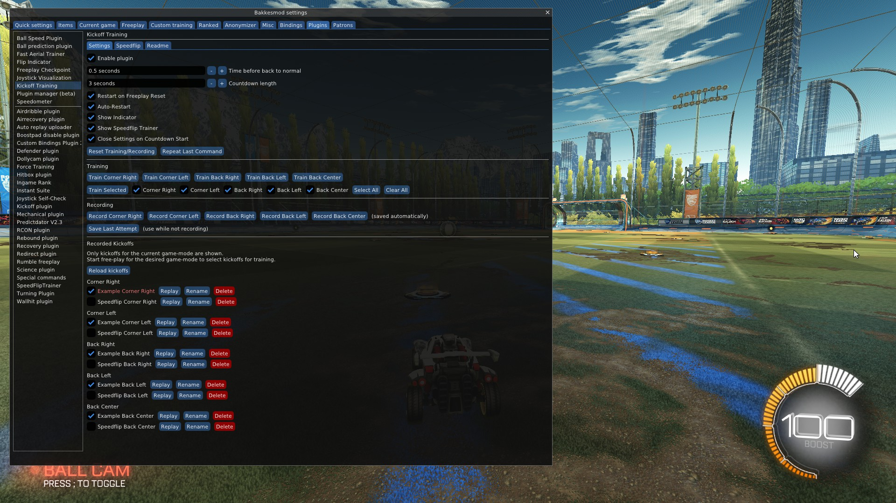
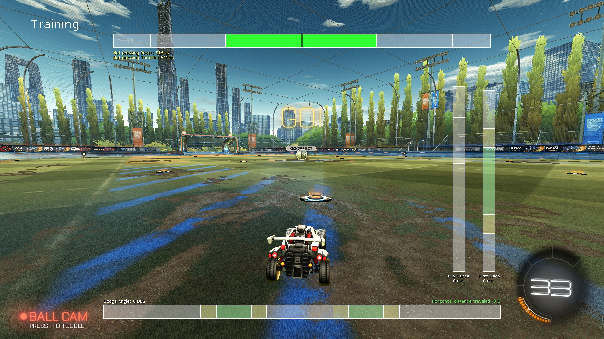
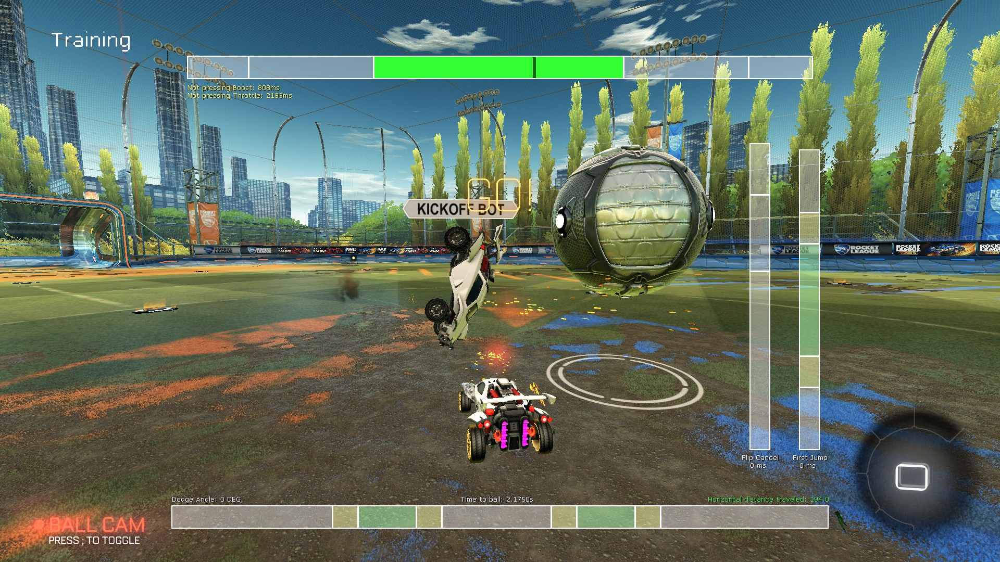
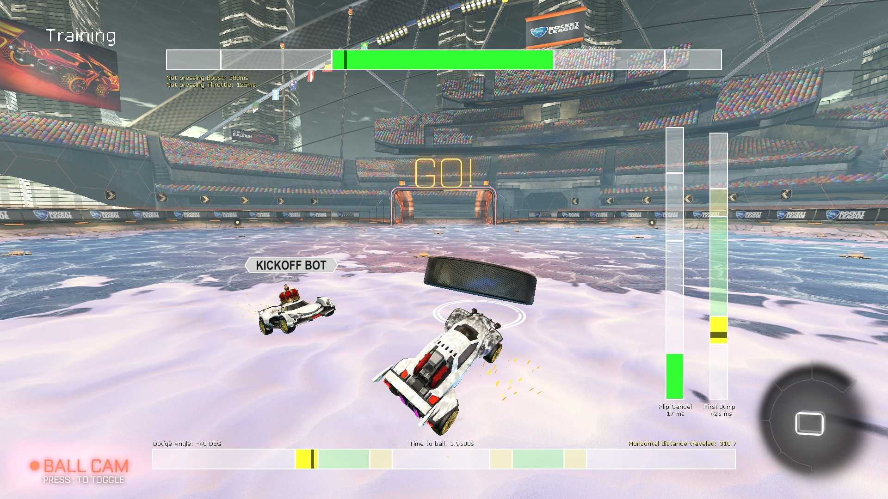
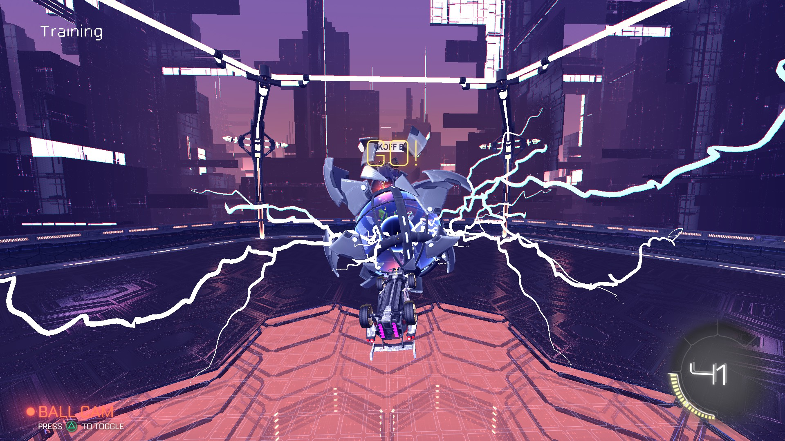
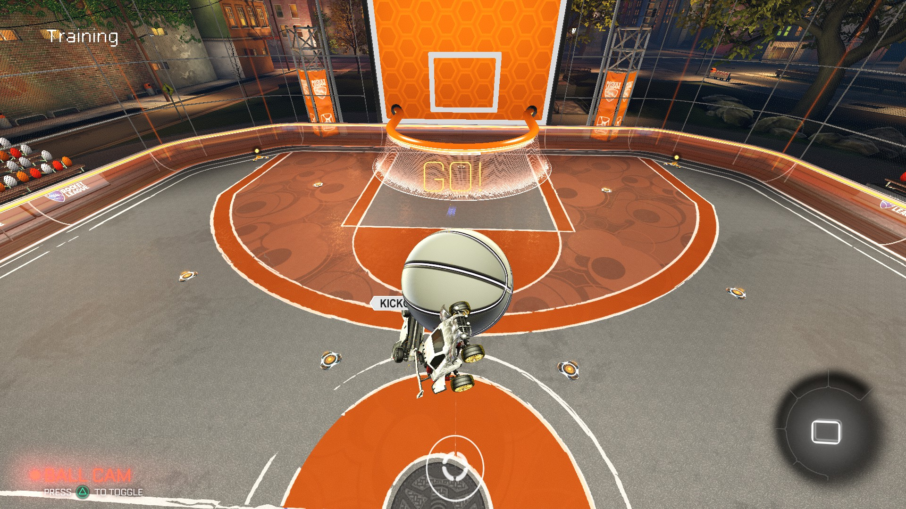

# Better Kickoff Training

Better Kickoff Training is a BakkesMod plugin for RocketLeague that helps you train your kickoffs by spawning a bot in freeplay to face you on kickoffs.

This plugin also uses the core of the great [Speedflip Trainer Plugin](https://bakkesplugins.com/plugins/view/286).

## How it Works

The plugin spawns a bot (in freeplay), sets up a random kickoff and replays pre-recorded inputs for the bot. That's all there is to it.

So just reset freeplay and you're good to go!

When you want to customize your training, bind different commands or record your own kickoffs, this plugin got you covered.  
Just read on for instructions or figure it out yourself.

## Quick Feature List

- Seamless Integration into Freeplay
- Works for Soccar, Hoops, Dropshot and Snowday
- Works for Different Game-Speed (read: Slow-Motion)
- Random Selection of Kickoffs
- Recorded Kickoffs can be Shared
- Tons of Customization

## Screenshots

## Setup and Settings

### Quick Start

- Install [BakkesMod](https://bakkesplugins.com/) (PC only).
- Install the plugin through the [BakkesMod website](https://bakkesplugins.com/plugin-search/1/kickoff).
- Start freeplay.  
  _All major game-modes are supported: Soccar, Hoops, Dropshot and Snowday._
- Open BakkesMod settings (`F2`). Select the "Plugins" tab. Select "Kickoff Training" on the left.
- In the "Training" section: Select the positions you want to train and click "Train Selected".  
  _You will start training against some pre-recorded kickoffs._
- Training will go on until you reset freeplay.  
  _If you don't want to auto-restart the kickoff training, uncheck the "Auto-Restart" option._
- If you made a good attempt you want to save, pause the game and click "Save Last Attempt" (in the "Recording" section).  
  _It will automatically be selected for training._
- To continue training with the same settings, just reset freeplay again.

### Recording Kickoffs

- You would want to just use "Save Last Attempt" most of the time when training.
- To record a kickoff without facing a bot, click one of the "Record ..." buttons.  
  _The recorded kickoffs will be saved and selected automatically._

### Training Different Kickoffs

- If you want to train one position only, use the "Train _Position_" buttons.
- If you want to select a random kickoff from a set of positions, use the "Train Selected" button.
- The next kickoff will be randomly selected from all suitable active recordings.  
  _If you train "Right Corner" and "Left Corner", but you have twice the amount of "Left Corner" kickoffs selected, they will be two times as likely._
- Uncheck a recording, if you want to exclude it from training.  
  _Click "Replay" next to the recording in question to check it._

### Manually Adding Recordings

- Go to the BakkesMod data folder (usually `%appdata%\bakkesmod\bakkesmod`) and open `.\data\kickofftraining`.
- You can manually add, rename or delete recordings. Just make sure they end in `.kinputs` to be recognized by the plugin.
- If you made changes to these files while the game was running, click "Reload Files" to apply changes.  
  _Renaming a recording file will deselect it._

### Binding Buttons

- If you want to have custom bindings for different actions, most of them are accessible via commands.
- Hover over a button to see what command it uses or explore commands/variables starting with `kickoff_train` in the console (open with F6).  
  _You could bind `kickoff_train_auto_restart 1; kickoff_train_active_positions 11000; kickoff_train` to train both corner kickoffs._
- I recommend the [Custom Bindings Plugin](https://bakkesplugins.com/plugins/view/228) even for keyboard users.  
  _Example: Bind `kickoff_train 2` (Left Corner) to L3+Left and `kickoff_train 1` (Right Corner) to L3+Right._

### Slow-Motion

- The plugin also works for slower game speeds! So you can record and train in slow-motion.
- You have to set the game-speed yourself. There is no automation for that in this plugin.
- Slow-motion also affects countdowns. But you can adjust the countdown duration.

### Different Game-Modes

- The plugin supports training kickoffs for all game-modes available in freeplay: Soccar, Hoops, Dropshot and Snowday.
- Only kickoffs for the current game-mode are displayed. If recordings are missing or the game-mode is not matching, make sure you are in freeplay and the ball is of the correct type.  
  _The `load_freeplay` command always loads a soccar ball!_

### Fine-Tuning

- Enabling "Auto-Restart" will loop the last command indefinitely (Training, Recording or Replaying).  
  But it makes saving the last attempt harder... You have to pause before the countdown is over.  
  Exit the loop by resetting or exiting freeplay or clicking the "Reset Training/Recording" button.
- If you don't want the plugin to start when resetting freeplay, uncheck "Restart on Freeplay Reset".
- "Time before back to normal": This settings affects how much time after hitting the ball is still considered a kickoff.  
  This also affects recording length. Changing this setting won't update old recordings (obviously).
- "Show Speedflip Trainer" will enable the [Speedflip Trainer Plugin](https://bakkesplugins.com/plugins/view/286) overlay. You don't need to install the plugin.  
  I only ported the applicable features of this plugin (for example the automatic game speed adaption got lost). Make sure to check out the original, too.

## Technical Details

- You can use any car or have any control settings you like. You can even change them later on.  
  The plugin will spawn the bot with the right car and settings to re-create the kickoff as good as possible.
- Since only the inputs are recorded, there can be slight inconsistencies when replaying it.  
  I made sure to test it thoroughly and got it working well, but there might still be issues on other machines.  
  If you have such a case, please let me know!

## Contributing

All contributions welcome!

I hope the code is good enough for others to understand. Feel free to open an issue, if something is unclear.

If you don't know how to code plugins and want to learn it, please visit https://wiki.bakkesplugins.com/plugin_tutorial/getting_started/ 
and join the [BakkesMod programming discord](https://discord.gg/s97RgrgkxE).

## Licensing

This project is licensed under the GNU General Public License (GPL). See the [LICENSE](./LICENSE) file for details.

This project is a fork of the MIT-licensed [kickoffPractice by @MrMoine](https://github.com/MrMoine/kickoffPractice). The MIT-licensed code retains its original copyright notice and license terms. See the [LICENSE-MIT](LICENSE-MIT) file for details.

[Speedflip Trainer by @tynidev](https://github.com/tynidev/SpeedFlipTrainer) was integrated into this project and adjusted to make it work for this use-case.

## Troubleshooting

Something now working as expected? Look at the BakkesMod console first (open with `F6`)!
There might be some error message telling you what's wrong.

If this still does not resolve your issue, don't hesitate to open a [issue on GitHub](https://github.com/Josef37/KickoffPractice/issues).
Please be as specific as possible when describing your issue.
